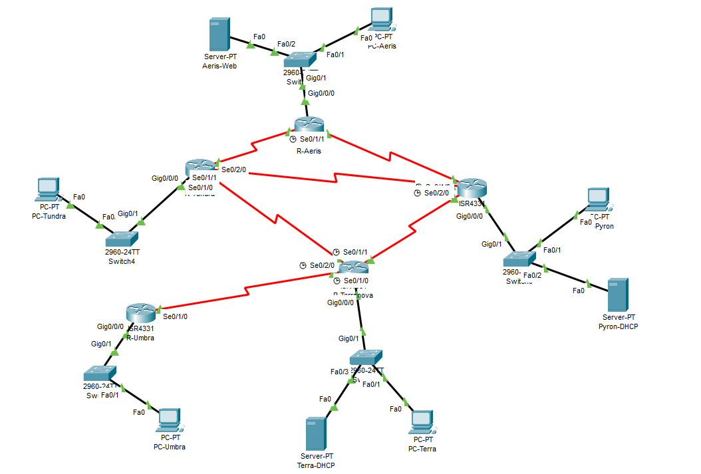

# 🌍 The Four Nations Communication Alliance

> **Role:** Network Architect | **Tools:** Cisco Packet Tracer | **Protocols:** VLSM, OSPF/RIPv2, DHCP, DNS, SMTP

## 📜 Project Overview
Eldoria, a land divided into four nations (Aeris, Pyron, Tundra, Terranova) and one rogue state (Umbra), requires a resilient communication network to defend against intercepted messages and sabotage. 

As the lead engineer for the **Council of Connectivity**, I designed and implemented a unified network infrastructure that adheres to strict geopolitical constraints, diverse topographical challenges, and varying security levels.



## 🛠️ Technical Key Features
* **Variable Length Subnet Masking (VLSM):** optimized a single address block to support over 3,800 devices across 5 distinct subnets with zero overlap.
* **Hybrid Routing Architecture:**
    * **Static Routing:** Implemented for high-security links (Aeris & Pyron).
    * **Dynamic Routing (RIPv2):** Used for adaptable, weather-prone regions (Tundra & Terranova).
    * **Floating Static Routes:** Created backup paths (AD 25) for Aeris to ensure redundancy.
* **DHCP Hierarchy:**
    * **Central Authority:** Terranova router acts as the DHCP server for itself, Tundra, and Umbra.
    * **DHCP Relay:** Configured on Tundra and Umbra routers to forward requests across subnets.
    * **Local Scope:** Pyron manages its own independent DHCP pool.
* **Core Services:**
    * **DNS & Web:** "Aeris-Alliance" web server (Fixed IP).
    * **Email:** Functional SMTP/POP3 services between Pyron and Terranova for intelligence sharing.

## 🗺️ Nation Specifications & Constraints

| Nation | Environment | Routing/IP Strategy | Role |
| :--- | :--- | :--- | :--- |
| **Aeris** | Skyborne Islands | Static IPs, Static Routing | **DNS/Web Host.** High security, zero tolerance for breaches. |
| **Pyron** | Volcanic Strongholds | Local DHCP, Static Routing | **Military Intel.** Requires rapid mobility and Email exchange. |
| **Tundra** | Iced Caverns | DHCP (via Relay), RIPv2 | **Redundancy.** Prone to outages; uses dynamic routing for survival. |
| **Terranova** | Riverlands | Central DHCP Server, RIPv2 | **Logistics Core.** Assigns IPs to Tundra & Umbra. Hosts Email. |
| **Umbra** | Rogue Caves | DHCP (via Relay), Restricted | **Surveillance.** Traffic strictly controlled. Cannot route directly to Aeris. |

## ⚙️ Configuration Highlights

### 1. Centralized DHCP & Relay
Terranova acts as the server, but Tundra clients are on a different network. I used the `ip helper-address` command on the Tundra Gateway interface to relay requests.
```cisco
! On Tundra Router Interface
interface GigabitEthernet0/0
 ip address [Tundra_Gateway_IP] [Subnet_Mask]
 ip helper-address [Terranova_Server_IP]
